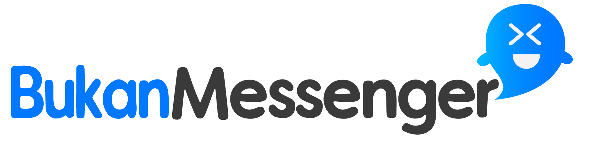

<h1 align="center">
  <br>
</h1>

## Important
This project is still on very early development stage. If you want to use for production, use it with your own risk.
<br>More feature Coming Really Soon.

## BukanMessenger
BukanMessenger is a Messenger app build on top React Native and Meteor Js. 
It is customizeable and some new feature will coming soon every week.

<div align="center">
  &nbsp;&nbsp;&nbsp;&nbsp;
</div>

## Why BukanMessenger?
* It's React Native, so it support android & iOS by default!
* Simple Code, so you can easily contribute on it.
* Meteor is one of the most starred javascript framework, and it is very easy to use

## Prerequisites
* Make sure You had been install NodeJs in your system https://nodejs.org/en/
* And ofc React Native https://facebook.github.io/react-native/
* Don’t forget Meteor Js as the backend https://www.meteor.com/

## Installation & Configuration
React Native https://github.com/radiegtya/BukanMessenger (Front-end)
```
$ git clone https://github.com/radiegtya/BukanMessenger
$ cd BukanMessenger
$ npm install
$ react-native run-ios #or react-native run-android
```
Meteor https://github.com/radiegtya/BukanMessengerBackend (Back-end)
```
$ git clone https://github.com/radiegtya/BukanMessengerBackend
$ cd BukanMessengerBackend
$ meteor npm install
$ meteor #run your meteor on http://localhost:3000
```

Open “app/Config.js”, and set the meteorUri variable as your Meteor server run at
```javascript
export const meteorUri = ‘ws://localhost:3000/websocket’;
```

## Support Us :)
* Star this repository :star:
* We are Ready to give Training to You/Your company to use/modify BukanMessenger. 
* Buy our screencast about the basic development of BukanMessenger (COMING SOON)
* Like our facebook page https://www.facebook.com/ega.sdr

## Roadmap

Status Note:
* Done ✅: already done completely
* Contribute : We need Your help to contribute
* Contribute ✅: its already done but need improvement and your contribution

### SignIn Module

|    Feature         | Status  |
|--------------------|-----|
| Phone Verification |  Done ✅    |
| SMS to Requester   |  Contribute   |

### Contacts Module

|    Feature         | Status  |
|--------------------|-----|
| Contact List  |  Done ✅    |
| Merge with native Contact   |  Contribute ✅  |
| New Contact  |  Done ✅    |
| Search Contact  |  Done ✅    |

### Chats Module

|    Feature         | Status  |
|--------------------|-----|
| Chat List |  Done ✅    |
| Search Chat   |  Contribute ✅   |
| New Chat |  Done ✅    |
| New Group |  Done ✅    |

### Messages Module

|    Feature         | Status  |
|--------------------|-----|
| Messages List |  Done ✅    |
| Send/Receive Message |  Done ✅    |
| Edit Message |  Contribute   |
| Reply Message |  Contribute   |
| Delete Message |  Contribute   |
| Forward Message |  Contribute   |
| Info Message |  Contribute   |
| Push Notification |  Contribute   |
| Messages Detail & Members |  Done ✅   |
| Date Separator |  Done ✅   |
| Image Upload & Camera Upload |  Contribute   |
| Video Upload |  Contribute   |
| Video Call |  Contribute   |
| Location Share |  Contribute   |

### Settings Module

|    Feature         | Status  |
|--------------------|-----|
| Update Profile |  Done ✅    |
| FAQ |  Contribute ✅    |
| Contact Us |  Contribute ✅    |
| Set Profile Picture |  Contribute    |
| Sign Out |  Done ✅    |

## Contact us
* WA/TELEGRAM: +6285641278479
* email: radiegtya@yahoo.co.id

----

## License

BSD 3-Clause License

See [LICENSE](LICENSE)
